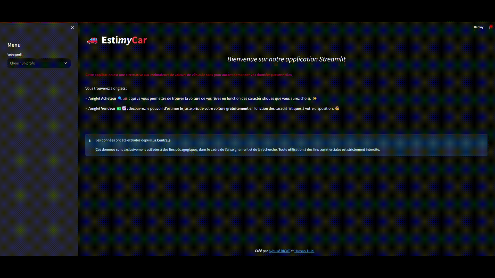

# EstimyCar 🚗

*EstimyCar qu'est-ce que c'est ?*

La plupart des français utilisent la *côte ARGUS* comme estimateur de prix mais comment se calcule-t-elle ?

> Elle est basée sur le cours moyen de l'Argus, constitué en collaboration avec des professionnels du secteur, des concessionnaires allant jusqu'au constructeur, ainsi que des particuliers et des annonces de vente de véhicules.


- **Inconvénients** : Payant, manque de transparence.

- **Objectif** : créer notre propre côte ARGUS gratuite et sans filtre  

L'objectif final est de fournir des estimateurs de valeurs de véhicule basés sur des caractéristiques spécifiques.


## Scraping
Scraping des annonces de vente de voiture d'occasion sur le site de [LaCentrale.fr](https://www.lacentrale.fr).

- Scraping de pages d'annonces par marque et par modèles de véhicule à l'aide de requêtes http grâce aux packages [`requests`](https://github.com/psf/requests) et [`bs4`](https://www.crummy.com/software/BeautifulSoup/bs4/doc/) 🕸️.
- Construction des URLs par marque et modèle pour l'extraction de toutes les annonces avec les fonctions `recup_pages()` et `extract_toutes_annonces()`
- Récupération de chacune des caractéristiques du véhicule pour chaque annonce à l'aide de la fonction `recup_information_voiture()`. 
- Extraction en plusieurs parties des données sous format JSON et fusion des fichiers avec `fusionner_fichiers_json()`.

## Nettoyage des données brutes

- Utilisation du package [`Polars`🐻‍❄️](https://pola.rs/)  pour le nettoyage et la réorganisation des données. 
- Mise en œuvre de la fonction `gazoduc()`, une séquence de pipes, pour traiter l'ensemble de la base de données de manière structurée et efficace.

## Machine Learning

Que peut-on prédire sur les voitures ? Eh bien, le **prix** bien sûr ! Mais comment estimer le prix d'un véhicule ? C'est la grande interrogation au cœur de notre approche en Machine Learning.

- Utilisation du package [`scikit-learn`](https://scikit-learn.org/stable/) 🧠.
- **Un modèle dédié par marque de voiture** *(au total, 40 marques ont été sélectionnées en fonction du nombre d'annonces)*.
- Modèles et grille de paramètres avec `set_models()` et `get_params()`
  - Modèles retenus :
    - Régression linéaire 📈
    - K-neighbors 👬👭
    - Random Forest 🌳
- Pour récupérer et exporter les meilleurs modèles (à l'aide de [`joblib`](https://joblib.readthedocs.io/en/stable/#)) : `get_all_models()`.
- `predict_prix` pour prédire le prix du véhicule 🚗💰.


## L'application  🚀

Cette application a été conçu à l'aide de [`streamlit`](https://github.com/streamlit/streamlit) offre une alternative aux estimateurs de valeurs de véhicule, garantissant la confidentialité des données personnelles des utilisateurs. Le menu latéral permet à l'utilisateur de personnaliser sa recherche en sélectionnant les caractéristiques de son véhicule.

### Accueil 🏠
L'accueil fournit des informations générales sur l'application, expliquant son utilité en tant qu'alternative aux estimateurs de valeurs de véhicules. De plus, il donne un aperçu des différents onglets disponibles et indique la source des données utilisées.




### Onglet Acheteur 🔍🚗
Cet onglet va vous permettre de trouver la voiture de vos rêves en fonction des caractéristiques que vous aurez choisi. ✨

Cet onglet offre deux fonctionnalités principales :

#### - Recherche d'annonces de voitures 🕵️‍♂️:

Vous pouvez trouver des annonces de voitures correspondant aux caractéristiques que vous aurez renseignées, si vous souhaitez acheter une voiture.
> Les critères que vous pourrez choisir sont : la/les marque(s), modèle(s), l'année minimale et maximale, le kilométrage minimal et maximal, la boîte de vitesses, l'énergie, et enfin le prix minimal et maximal.


**Le DataFrame se mettra automatiquement à jour en fonction des caractéristiques renseignées. Vous pourrez également visualiser le nombre total de voitures correspondant à vos critères ainsi que le prix moyen.**

*Démonstration :*


#### - Statistiques Descriptives 📊

Explorez les statistiques descriptives pour obtenir des informations clés sur le marché automobile :

- **Nombre de modèles par marque :** Découvrez la diversité des modèles proposés par chaque marque.
- **Prix moyen par marque :** Obtenez une idée du prix moyen des voitures en fonction de la marque.
- **Histogramme des prix :** Visualisez la répartition des prix pour avoir une vision globale du marché 🌐. 

*Démonstration :*


### Onglet Vendeur 💵📈

Découvrez le pouvoir d'estimer le juste prix de votre voiture gratuitement en fonction des caractéristiques à votre disposition. 😎

#### - Estimation du Prix 🚗💰

Vous pouvez estimer la valeur de votre véhicule en renseignant les caractéristiques suivantes :
- La marque et le modèle
- L'année
- Le moteur, le cylindre et la puissance
- Le kilométrage
- La boîte de vitesses
- Le type d'énergie (et la batterie, si la voiture est électrique)
- La génération et la finition

Vous obtiendrez ainsi une estimation précise et gratuite de la valeur de votre voiture.

*Démonstration*


#### - Estimation par Kilométrage 📈

Visualisez **l'évolution de la valeur de votre voiture en fonction du kilométrag**e. Un graphique clair vous permettra de prendre des décisions éclairées sur le prix en fonction du kilométrage de votre véhicule.


> Pour accéder à ces fonctionnalités, cliquez sur le bouton "Estimer la valeur du véhicule." ou "Estimer la valeur de votre véhicule selon le kilométrage.".

## Installation

Toutes les dépendances nécessaire pour faire fonctionner l'application ont été généré à l'aide de `poetry`. Elle peuvent être installé à l'aide de la commande suivante : 

```powershell
python -m poetry install
python -m poetry shell
```

Ensuite il suffit de lancer l'application avec la ligne de commande suivante :

```powershell
python -m streamlit run "streamlit_app.py"
```

## Licence


